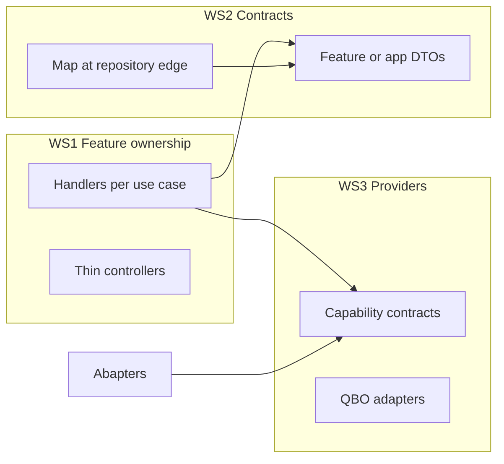

# AI Readiness Roadmap — Verification and Execution Todos

## Verification (repo vs. document)

| Roadmap claim | Repo evidence |
|---------------|---------------|
| `Features/*` as HTTP boundary | Controllers live under [`QuickBooksAPI/Features/`](d:\Misc\QuickBooksAPI\QuickBooksAPI\Features) (e.g. [`ProductController.cs`](d:\Misc\QuickBooksAPI\QuickBooksAPI\Features\Products\ProductController.cs)). |
| Typed options / shared contracts | [`Program.cs`](d:\Misc\QuickBooksAPI\QuickBooksAPI\Program.cs) uses `QuickBooksShared` / `QuickBooksShared.Options` and `AddQuickBooksTypedOptions`. |
| CI, architecture tests, `AI_GUIDELINES.md` | [`tests/ArchitectureTests/UnitTest1.cs`](d:\Misc\QuickBooksAPI\tests\ArchitectureTests\UnitTest1.cs); [`AI_GUIDELINES.md`](d:\Misc\QuickBooksAPI\AI_GUIDELINES.md) defines safe zones and high-risk files. |
| Thin composition root | [`Program.cs`](d:\Misc\QuickBooksAPI\QuickBooksAPI\Program.cs) delegates to extension methods (`AddQuickBooksAuthAndEntityApplicationServices`, `AddInfrastructure`, etc.); further splitting matches Workstream 4. |
| Shared product logic still in Services | [`ProductServices.cs`](d:\Misc\QuickBooksAPI\QuickBooksAPI\Services\ProductServices.cs) plus `.Crud`, `.Mapping`, `.Sync` — pilot target is accurate. |
| Provider isolation pilot | [`Integrations/Abstractions/`](d:\Misc\QuickBooksAPI\QuickBooksAPI\Integrations\Abstractions) (`IProductAccountingSyncGateway`, `IVendorAccountingSyncGateway`) and [`Integrations/QuickBooks/`](d:\Misc\QuickBooksAPI\QuickBooksAPI\Integrations\QuickBooks) adapters — expand per Workstream 3. |
| Full sync orchestration | [`SyncWorker/FullSyncOrchestrator.cs`](d:\Misc\QuickBooksAPI\SyncWorker\FullSyncOrchestrator.cs) + [`FullSyncWorker.cs`](d:\Misc\QuickBooksAPI\SyncWorker\FullSyncWorker.cs). |
| Per-domain frontend API modules | [`QuickBooksAPI Frontend/app/src/api/*Api.ts`](d:\Misc\QuickBooksAPI\QuickBooksAPI%20Frontend\app\src\api) — `core.ts` / `client.ts` present for transport-only layering. |
| OpenAPI artifact for codegen | CI step `dotnet swagger tofile` uploads `openapi-v1` in [`.github/workflows/ci.yml`](d:\Misc\QuickBooksAPI\.github\workflows\ci.yml). |

**Adjustments to keep in mind**

- **AI_GUIDELINES high-risk files**: [`Program.cs`](d:\Misc\QuickBooksAPI\QuickBooksAPI\Program.cs), [`QuickBooksAPI/Infrastructure/DependencyInjection.cs`](d:\Misc\QuickBooksAPI\QuickBooksAPI\Infrastructure\DependencyInjection.cs), and [`SyncWorker/Program.cs`](d:\Misc\QuickBooksAPI\SyncWorker\Program.cs) are flagged for human review — Workstreams 4 and 7 should use small, extension-based edits and stay consistent with that policy.
- **Architecture tests today**: Rules already enforce no `DataAccessLayer.Models` on several `Application.Interfaces` types (e.g. `IProductService`, `ICustomerReadService`). The roadmap’s “handlers must not depend on QuickBooksService.Services” and “migrated features must not reintroduce shared service deps” will require **new** NetArch tests (or equivalent) scoped to migrated namespaces/types.
- **Folder naming**: The doc says `Integrations/Providers/QuickBooks`; the repo currently uses `Integrations/QuickBooks/`. Prefer aligning naming in a follow-up PR rather than duplicating trees.

## Suggested dependency flow (high level)

## Phased todos (aligned to recommended migration order)

### Phase 0 — Baseline and gates (prep)

- Add **characterization tests** for current `ProductServices*` / `ChartOfAccountsServices` / sync paths where behavior will move (before large refactors).
- Extend **architecture tests** with placeholders or feature-scoped rules only where the first slice is migrated (avoid blanket failures on unmigrated code); tighten to **blocking** once Products is the template.

### Phase 1 — Products end-to-end template (Workstreams 1–5 for Products)

- Move product use cases from [`Services/ProductServices*.cs`](d:\Misc\QuickBooksAPI\QuickBooksAPI\Services) into `Features/Products/{Commands,Queries,Handlers,Contracts}` with **one handler per use case**; keep [`ProductController`](d:\Misc\QuickBooksAPI\QuickBooksAPI\Features\Products\ProductController.cs) routes unchanged.
- Introduce **feature/application DTOs**; ensure handlers return those, not persistence models; map at repository boundary (Workstream 2).
- **Abstract product sync/commands** behind `Integrations` contracts; implement QBO in [`Integrations/QuickBooks/`](d:\Misc\QuickBooksAPI\QuickBooksAPI\Integrations\QuickBooks); **no direct `QuickBooksService.Services` from handlers** (Workstream 3).
- Extract **Products registration** into `AddProductsFeature()` (or equivalent) so feature DI is localized (Workstream 4); optional **migration-only facade** in shared Services with explicit comment if needed for compatibility.
- **Stop growth** of [`ProductServices*.cs`](d:\Misc\QuickBooksAPI\QuickBooksAPI\Services): new behavior only in feature handlers (Workstream 5).

### Phase 2 — Chart of accounts (repeat template)

- Same pattern as Products: handlers, contracts, repository mapping, provider adapter for COA sync/list, `AddChartOfAccountsFeature()`, shrink [`ChartOfAccountsServices.cs`](d:\Misc\QuickBooksAPI\QuickBooksAPI\Services\ChartOfAccountsServices.cs).

### Phase 3 — Worker: staged orchestration (Workstream 7)

- Refactor [`FullSyncOrchestrator.cs`](d:\Misc\QuickBooksAPI\SyncWorker\FullSyncOrchestrator.cs) to **top-level sequencing only**; extract **entity sync runner**, **status lifecycle**, **post-sync follow-up** into internal staged handlers; keep `FullSyncMessage` and Service Bus as-is unless a new message clearly reduces coupling (`full sync completed`, `warehouse rebuilt`).

### Phase 4 — Auth and analytics hotspots (Workstream 5)

- Split [`QuickBooksAuthService`](d:\Misc\QuickBooksAPI\QuickBooksService\Services\QuickBooksAuthService.cs) (or app-layer lifecycle services) by **transport** concerns: token exchange, refresh, revoke, company info — per roadmap acceptance.
- Refactor [`Features/Analytics/*`](d:\Misc\QuickBooksAPI\QuickBooksAPI\Features\Analytics): keep routes; move logic to **query handlers** to reduce controller-as-hub coupling.

### Phase 5 — Remaining accounting entities (Workstream 1–3)

- Repeat for **Customers, Vendors, Bills, Invoices, JournalEntries** one feature at a time: feature ownership, contract cleanup, provider adapters, **no new shared “manager” services** under [`QuickBooksAPI/Services`](d:\Misc\QuickBooksAPI\QuickBooksAPI\Services).

### Phase 6 — Frontend contract generation (Workstream 6)

- Use CI **OpenAPI artifact** as source; generate TS types for **Analytics, Companies, CfoAssistant** first; **commit generated types**; update `*Api.ts` to import generated request/response types while keeping [`core.ts`](d:\Misc\QuickBooksAPI\QuickBooksAPI%20Frontend\app\src\api\core.ts) transport-only.
- Add **CI freshness check** (regenerate + diff) after first domains are migrated.

### Phase 7 — Final architecture enforcement

- Add blocking rules: **migrated application contracts** never reference `DataAccessLayer.Models`; **handlers** in migrated features never reference `QuickBooksService.Services`; **no reintroduction** of shared service dependencies for migrated slices.
- Per feature: **unit tests for handlers**; **repository tests** where mapping/SQL is risky; **API smoke/route compatibility** tests for controllers.
- **Provider**: adapter unit tests + at least one **sandbox smoke** path for QBO-backed flows.

## Acceptance checklist (cross-cutting)

- **Route compatibility**: Public routes unchanged unless versioned.
- **Stack**: .NET 8, Dapper, SQL, Azure Functions, React/Vite unchanged; stored procedures stay behind repositories.
- **Adding a second provider**: new adapters + registration only, not feature handler rewrites (for migrated slices).
