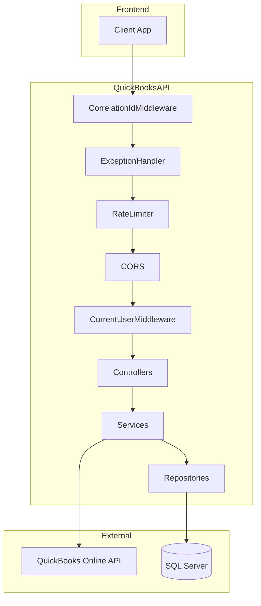

# QuickBooks API - Backend Documentation

A .NET 8 Web API for QuickBooks Online integration. Provides JWT authentication, QuickBooks OAuth 2.0 connectivity, and full CRUD/sync operations for Customers, Products, Vendors, Bills, Invoices, Chart of Accounts, and Journal Entries.

**Base URL (Development):** `https://localhost:7135`  
**Swagger UI:** `https://localhost:7135/` (root)

---

## Table of Contents

1. [Tech Stack](#tech-stack)
2. [Architecture](#architecture)
3. [Authentication](#authentication)
4. [API Response Structure](#api-response-structure)
5. [Error Handling](#error-handling)
6. [Rate Limiting & CORS](#rate-limiting--cors)
7. [Endpoints Reference](#endpoints-reference)
8. [Auth Endpoints](#auth-endpoints)
9. [Entity Endpoints](#entity-endpoints)
10. [Entity Model Structures](#entity-model-structures)
11. [Request DTO Structures](#request-dto-structures)
12. [QuickBooks OAuth Flow](#quickbooks-oauth-flow)
13. [Configuration](#configuration)
14. [Docker](#docker)

---

## Tech Stack

- **.NET 8** / ASP.NET Core Web API
- **JWT Bearer** authentication
- **SQL Server** with Dapper for persistence
- **QuickBooks Online API** (via QuickBooksService library)
- **Swagger/OpenAPI** for interactive documentation

---

## Architecture



**Middleware pipeline order:**
1. CorrelationIdMiddleware – adds/forwards `X-Correlation-Id`
2. ExceptionHandlerMiddleware – catches unhandled exceptions
3. RateLimiter – enforces request limits
4. CORS
5. CurrentUserMiddleware – extracts UserId and RealmId from JWT/headers

---

## Authentication

### JWT Structure

- Login returns `ApiResponse<string>` where `data` is the JWT token
- Send token as: `Authorization: Bearer <token>`
- Token expiry: 2 hours (configurable)

**JWT Claims:**
| Claim | Description |
|-------|-------------|
| `UserId` | User ID (int as string) |
| `NameIdentifier` | Same as UserId |
| `Name` | Username |
| `RealmIds` | JSON array of connected QuickBooks company IDs, e.g. `["1234567890"]` |

### Realm Selection

Most endpoints require `UserId` and `RealmId`. RealmId is resolved in this order:

1. `X-Realm-Id` request header
2. `realm_id` claim (if present)
3. First element of `RealmIds` claim

**Frontend:** When the user has multiple QuickBooks companies, send `X-Realm-Id: <realmId>` on each request.

### Bypass Paths (no UserId/RealmId validation)

- `/api/auth/login`
- `/api/auth/SignUp`
- `/api/auth/callback`
- `/swagger`, `/`

---

## API Response Structure

All API responses use the `ApiResponse<T>` wrapper:

```json
{
  "success": true,
  "message": "Optional message",
  "data": { },
  "errors": null
}
```

| Property | Type | Description |
|----------|------|-------------|
| `success` | boolean | `true` on success, `false` on failure |
| `message` | string | Human-readable message |
| `data` | T | Response payload (entity, array, or primitive) |
| `errors` | string[] | Optional array of error details (on failure) |

**Success example:**
```json
{
  "success": true,
  "message": "Login successful.",
  "data": "eyJhbGciOiJIUzI1NiIsInR5cCI6IkpXVCJ9...",
  "errors": null
}
```

**Failure example:**
```json
{
  "success": false,
  "message": "Login failed.",
  "data": null,
  "errors": ["Invalid password provided."]
}
```

---

## Error Handling

| Status | Condition | Response |
|--------|-----------|----------|
| 401 | Missing or invalid token | `ApiResponse<object>` with message "Invalid token" or "Authentication required" |
| 403 | Missing UserId or RealmId | `ApiResponse<object>` with message "Forbidden" and errors listing missing claims |
| 429 | Rate limit exceeded | `ApiResponse<object>` with message "Too Many Requests" |
| 500 | Unhandled exception | `ApiResponse<object>` with generic message; includes `X-Correlation-Id` header for support |

---

## Rate Limiting & CORS

**Rate Limiting:**
- Config: `RateLimiting:PermitLimit` (default 100), `RateLimiting:WindowSeconds` (default 60)
- Keyed by authenticated UserId or by IP for anonymous requests

**CORS:**
- Configure `Cors:AllowedOrigins` in appsettings for production
- Development: AllowAll when no origins are configured

---

## Endpoints Reference

| Method | Path | Auth | Description |
|--------|------|------|-------------|
| POST | /api/auth/SignUp | No | Register new user |
| POST | /api/auth/login | No | Login, get JWT |
| GET | /api/auth/oAuth | Yes | Get QuickBooks OAuth URL |
| GET | /api/auth/callback | No | QuickBooks OAuth callback |
| GET | /api/customer/list | Yes | List customers from DB |
| GET | /api/customer/sync | Yes | Sync customers from QuickBooks |
| POST | /api/customer/create | Yes | Create customer |
| PUT | /api/customer/update | Yes | Update customer |
| DELETE | /api/customer/delete | Yes | Delete customer |
| GET | /api/product/list | Yes | List products from DB |
| GET | /api/product/sync | Yes | Sync products from QuickBooks |
| POST | /api/product/create | Yes | Create product |
| PUT | /api/product/update | Yes | Update product |
| DELETE | /api/product/delete | Yes | Delete product |
| GET | /api/vendor/list | Yes | List vendors from DB |
| GET | /api/vendor/sync | Yes | Sync vendors from QuickBooks |
| POST | /api/vendor/create | Yes | Create vendor |
| PUT | /api/vendor/update | Yes | Update vendor |
| DELETE | /api/vendor/softDelete | Yes | Soft-delete vendor |
| GET | /api/bill/list | Yes | List bills from DB |
| GET | /api/bill/sync | Yes | Sync bills from QuickBooks |
| POST | /api/bill/create | Yes | Create bill |
| PUT | /api/bill/update | Yes | Update bill |
| DELETE | /api/bill/delete | Yes | Delete bill |
| GET | /api/invoice/list | Yes | List invoices from DB |
| GET | /api/invoice/sync | Yes | Sync invoices from QuickBooks |
| POST | /api/invoice/create | Yes | Create invoice |
| PUT | /api/invoice/update | Yes | Update invoice |
| DELETE | /api/invoice/delete | Yes | Delete invoice |
| POST | /api/invoice/void | Yes | Void invoice |
| GET | /api/chartofaccounts/list | Yes | List chart of accounts from DB |
| GET | /api/chartofaccounts/sync | Yes | Sync chart of accounts from QuickBooks |
| GET | /api/journalentry/list | Yes | List journal entries from DB |
| GET | /api/journalentry/sync | Yes | Sync journal entries from QuickBooks |
| GET | /health | No | Health check |

---

## Auth Endpoints

### POST /api/auth/SignUp

**Request body:** `UserSignUpRequest`
```json
{
  "firstName": "John",
  "lastName": "Doe",
  "username": "johndoe",
  "email": "john@example.com",
  "password": "SecurePass1!"
}
```

**Validation:**
- FirstName, LastName: required, max 50 chars
- Username: 3–30 chars, letters, numbers, dots, underscores
- Email: valid format
- Password: 8–100 chars, at least 1 uppercase, 1 lowercase, 1 number, 1 special character

**Response:** `ApiResponse<int>` – `data` = new user ID

---

### POST /api/auth/login

**Request body:** `UserLoginRequest`
```json
{
  "email": "john@example.com",
  "password": "SecurePass1!"
}
```

**Response:** `ApiResponse<string>` – `data` = JWT token

---

### GET /api/auth/oAuth

**Auth:** Bearer token required

**Response:** `ApiResponse<string>` – `data` = QuickBooks OAuth authorization URL

---

### GET /api/auth/callback

**Query parameters:** `code`, `state`, `realmId` (from QuickBooks redirect)

**Response:** `ApiResponse<QuickBooksToken>`

**QuickBooksToken:**
```json
{
  "id": 1,
  "userId": 1,
  "realmId": "1234567890",
  "idToken": "...",
  "accessToken": "...",
  "refreshToken": "...",
  "tokenType": "bearer",
  "expiresIn": 3600,
  "xRefreshTokenExpiresIn": 8726400,
  "createdAt": "2025-02-10T12:00:00Z",
  "updatedAt": "2025-02-10T12:00:00Z"
}
```

---

## Entity Endpoints

### Customer

| Method | Path | Request | Response |
|--------|------|---------|----------|
| GET | /api/customer/list | - | `ApiResponse<IEnumerable<Customer>>` |
| GET | /api/customer/sync | - | `ApiResponse<int>` (count synced) |
| POST | /api/customer/create | CreateCustomerRequest | `ApiResponse<int>` |
| PUT | /api/customer/update | UpdateCustomerRequest | `ApiResponse<string>` |
| DELETE | /api/customer/delete | DeleteCustomerRequest | `ApiResponse<string>` |

### Product

| Method | Path | Request | Response |
|--------|------|---------|----------|
| GET | /api/product/list | - | `ApiResponse<IEnumerable<Products>>` |
| GET | /api/product/sync | - | `ApiResponse<int>` |
| POST | /api/product/create | CreateProductRequest | `ApiResponse<string>` |
| PUT | /api/product/update | UpdateProductRequest | `ApiResponse<string>` |
| DELETE | /api/product/delete | DeleteProductRequest | `ApiResponse<string>` |

### Vendor

| Method | Path | Request | Response |
|--------|------|---------|----------|
| GET | /api/vendor/list | - | `ApiResponse<IEnumerable<Vendor>>` |
| GET | /api/vendor/sync | - | `ApiResponse<int>` |
| POST | /api/vendor/create | CreateVendorRequest | `ApiResponse<string>` |
| PUT | /api/vendor/update | UpdateVendorRequest | `ApiResponse<string>` |
| DELETE | /api/vendor/softDelete | SoftDeleteVendorRequest | `ApiResponse<string>` |

### Bill

| Method | Path | Request | Response |
|--------|------|---------|----------|
| GET | /api/bill/list | - | `ApiResponse<IEnumerable<QBOBillHeader>>` |
| GET | /api/bill/sync | - | `ApiResponse<int>` |
| POST | /api/bill/create | CreateBillRequest | `ApiResponse<string>` |
| PUT | /api/bill/update | UpdateBillRequest | `ApiResponse<string>` |
| DELETE | /api/bill/delete | DeleteBillRequest | `ApiResponse<string>` |

### Invoice

| Method | Path | Request | Response |
|--------|------|---------|----------|
| GET | /api/invoice/list | - | `ApiResponse<IEnumerable<QBOInvoiceHeader>>` |
| GET | /api/invoice/sync | - | `ApiResponse<int>` |
| POST | /api/invoice/create | CreateInvoiceRequest | `ApiResponse<string>` |
| PUT | /api/invoice/update | UpdateInvoiceRequest | `ApiResponse<string>` |
| DELETE | /api/invoice/delete | DeleteInvoiceRequest | `ApiResponse<string>` |
| POST | /api/invoice/void | VoidInvoiceRequest | `ApiResponse<string>` |

### Chart of Accounts

| Method | Path | Request | Response |
|--------|------|---------|----------|
| GET | /api/chartofaccounts/list | - | `ApiResponse<IEnumerable<ChartOfAccounts>>` |
| GET | /api/chartofaccounts/sync | - | `ApiResponse<int>` |

### Journal Entry

| Method | Path | Request | Response |
|--------|------|---------|----------|
| GET | /api/journalentry/list | - | `ApiResponse<IEnumerable<QBOJournalEntryHeader>>` |
| GET | /api/journalentry/sync | - | `ApiResponse<int>` |

---

## Entity Model Structures

Use these structures for frontend TypeScript/JavaScript interfaces.

### Customer
```typescript
interface Customer {
  id: number;
  qboId: string;
  userId: string;
  realmId: string;
  syncToken: string;
  title: string;
  givenName: string;
  middleName: string;
  familyName: string;
  displayName: string;
  companyName: string;
  active: boolean;
  balance: number;
  primaryEmailAddr: string;
  primaryPhone: string;
  billAddrLine1: string;
  billAddrCity: string;
  billAddrPostalCode: string;
  billAddrCountrySubDivisionCode: string;
  createTime: string;  // ISO DateTime
  lastUpdatedTime: string;
  domain: string;
  sparse: boolean;
}
```

### Products
```typescript
interface Products {
  id: number;
  qboId: string;
  name: string;
  description: string | null;
  active: boolean;
  fullyQualifiedName: string;
  taxable: boolean;
  unitPrice: number;
  type: string;
  qtyOnHand: number | null;
  incomeAccountRefValue: string | null;
  incomeAccountRefName: string | null;
  purchaseCost: number;
  trackQtyOnHand: boolean;
  domain: string;
  sparse: boolean;
  syncToken: string;
  createTime: string;
  lastUpdatedTime: string;
  userId: number;
  realmId: string;
}
```

### Vendor
```typescript
interface Vendor {
  id: number;
  qboId: string;
  userId: string;
  realmId: string;
  syncToken: string;
  title: string;
  givenName: string;
  middleName: string;
  familyName: string;
  displayName: string;
  companyName: string;
  active: boolean;
  balance: number;
  primaryEmailAddr: string;
  primaryPhone: string;
  billAddrLine1: string;
  billAddrCity: string;
  billAddrPostalCode: string;
  billAddrCountrySubDivisionCode: string;
  createTime: string;
  lastUpdatedTime: string;
  domain: string;
  sparse: boolean;
  deletedAt: string | null;
  deletedBy: string | null;
}
```

### QBOBillHeader
```typescript
interface QBOBillHeader {
  billId: number;
  qboBillId: string;
  realmId: string;
  syncToken: string;
  domain: string | null;
  sparse: boolean;
  apAccountRefValue: string | null;
  apAccountRefName: string | null;
  vendorRefValue: string | null;
  vendorRefName: string | null;
  txnDate: string | null;
  dueDate: string | null;
  totalAmt: number;
  balance: number;
  isDeleted: boolean;
  currencyRefValue: string | null;
  currencyRefName: string | null;
  salesTermRefValue: string | null;
  createTime: string;
  lastUpdatedTime: string;
  rawJson: string | null;
}
```

### QBOInvoiceHeader
```typescript
interface QBOInvoiceHeader {
  invoiceId: number;
  qboInvoiceId: string;
  realmId: string;
  syncToken: string;
  domain: string | null;
  sparse: boolean;
  txnDate: string;
  dueDate: string;
  customerRefId: string | null;
  customerRefName: string | null;
  currencyCode: string | null;
  exchangeRate: number;
  totalAmt: number;
  balance: number;
  createTime: string;
  lastUpdatedTime: string;
  rawJson: string | null;
}
```

### ChartOfAccounts
```typescript
interface ChartOfAccounts {
  id: number;
  qboId: string;
  name: string;
  subAccount: boolean;
  fullyQualifiedName: string;
  active: boolean;
  classification: string | null;
  accountType: string | null;
  accountSubType: string | null;
  currentBalance: number;
  currentBalanceWithSubAccounts: number;
  currencyRefValue: string | null;
  currencyRefName: string | null;
  domain: string | null;
  sparse: boolean;
  syncToken: string;
  createTime: string;
  lastUpdatedTime: string;
  userId: number;
  realmId: string;
}
```

### QBOJournalEntryHeader
```typescript
interface QBOJournalEntryHeader {
  journalEntryId: number;
  qbJournalEntryId: string;
  qbRealmId: string;
  syncToken: string;
  domain: string | null;
  sparse: boolean | null;
  adjustment: boolean | null;
  txnDate: string | null;
  docNumber: string | null;
  privateNote: string | null;
  currencyCode: string | null;
  exchangeRate: number | null;
  totalAmount: number | null;
  homeTotalAmount: number | null;
  createTime: string | null;
  lastUpdatedTime: string | null;
  rawJson: string | null;
}
```

---

## Request DTO Structures

### Auth

**UserSignUpRequest:**
```json
{
  "firstName": "string",
  "lastName": "string",
  "username": "string",
  "email": "string",
  "password": "string"
}
```

**UserLoginRequest:**
```json
{
  "email": "string",
  "password": "string"
}
```

### Customer

**CreateCustomerRequest:**
```json
{
  "givenName": "string",
  "middleName": "string",
  "familyName": "string",
  "title": "string",
  "suffix": "string",
  "displayName": "string",
  "fullyQualifiedName": "string",
  "companyName": "string",
  "notes": "string",
  "primaryEmailAddr": { "address": "string" },
  "primaryPhone": { "freeFormNumber": "string" },
  "billAddr": {
    "line1": "string",
    "city": "string",
    "countrySubDivisionCode": "string",
    "postalCode": "string",
    "country": "string"
  }
}
```

**UpdateCustomerRequest:** Requires `id`, `syncToken`. Optional: `sparse`, `displayName`, `givenName`, `familyName`, `companyName`, `primaryEmailAddr`, `primaryPhone`, `billAddr`, `active`, `balance`, etc.

**DeleteCustomerRequest:**
```json
{
  "id": "string",
  "syncToken": "string",
  "sparse": false,
  "active": false
}
```

### Product

**CreateProductRequest:**
```json
{
  "name": "string",
  "description": "string",
  "active": true,
  "trackQtyOnHand": false,
  "type": "Inventory",
  "incomeAccountRef": { "name": "string", "value": "string" },
  "expenseAccountRef": { "name": "string", "value": "string" },
  "assetAccountRef": { "name": "string", "value": "string" },
  "unitPrice": 0,
  "purchaseCost": 0,
  "qtyOnHand": 0,
  "invStartDate": "2025-02-10"
}
```

**UpdateProductRequest:** Requires `id`, `syncToken`. Optional: `sparse`, `name`, `type`, `qtyOnHand`, `incomeAccountRef`, `expenseAccountRef`, `assetAccountRef`.

**DeleteProductRequest:**
```json
{
  "id": "string",
  "syncToken": "string",
  "active": false,
  "type": "string",
  "incomeAccountRef": { "value": "string", "name": "string" }
}
```

### Vendor

**CreateVendorRequest:**
```json
{
  "displayName": "string",
  "givenName": "string",
  "familyName": "string",
  "companyName": "string",
  "title": "string",
  "suffix": "string",
  "primaryEmailAddr": { "address": "string" },
  "primaryPhone": { "freeFormNumber": "string" },
  "mobile": { "freeFormNumber": "string" },
  "webAddr": { "uri": "string" },
  "billAddr": {
    "line1": "string",
    "line2": "string",
    "line3": "string",
    "city": "string",
    "postalCode": "string",
    "countrySubDivisionCode": "string",
    "country": "string"
  },
  "printOnCheckName": "string",
  "acctNum": "string",
  "taxIdentifier": "string"
}
```

**UpdateVendorRequest:** Requires `id`, `syncToken`. Optional: `sparse`, `displayName`, `givenName`, `familyName`, `companyName`, `primaryEmailAddr`, `primaryPhone`, `billAddr`, `active`, `balance`, etc.

**SoftDeleteVendorRequest:**
```json
{
  "id": "string",
  "syncToken": "string"
}
```

### Bill

**CreateBillRequest:**
```json
{
  "line": [
    {
      "detailType": "AccountBasedExpenseLineDetail",
      "amount": 0,
      "description": "string",
      "accountBasedExpenseLineDetail": {
        "accountRef": { "value": "string", "name": "string" },
        "taxCodeRef": { "value": "string", "name": "string" },
        "billableStatus": "string",
        "customerRef": { "value": "string", "name": "string" }
      },
      "itemBasedExpenseLineDetail": {
        "itemRef": { "value": "string", "name": "string" },
        "qty": 0,
        "unitPrice": 0,
        "taxCodeRef": { "value": "string", "name": "string" },
        "billableStatus": "string"
      },
      "projectRef": { "value": "string", "name": "string" }
    }
  ],
  "vendorRef": { "value": "string", "name": "string" },
  "txnDate": "2025-02-10",
  "dueDate": "2025-03-10",
  "docNumber": "string",
  "apAccountRef": { "value": "string", "name": "string" },
  "currencyRef": { "value": "string", "name": "string" },
  "privateNote": "string",
  "salesTermRef": { "value": "string", "name": "string" },
  "departmentRef": { "value": "string", "name": "string" }
}
```

**UpdateBillRequest:** Requires `id`, `syncToken`. Optional: `sparse`, `vendorRef`, `txnDate`, `dueDate`, `line`, etc.

**DeleteBillRequest:**
```json
{
  "id": "string",
  "syncToken": "string"
}
```

### Invoice

**CreateInvoiceRequest:**
```json
{
  "line": [
    {
      "detailType": "SalesItemLineDetail",
      "amount": 0,
      "description": "string",
      "salesItemLineDetail": {
        "itemRef": { "value": "string", "name": "string" },
        "qty": 0,
        "unitPrice": 0,
        "taxCodeRef": { "value": "string", "name": "string" }
      }
    }
  ],
  "customerRef": { "value": "string", "name": "string" },
  "txnDate": "2025-02-10",
  "dueDate": "2025-03-10"
}
```

**UpdateInvoiceRequest:** Requires `id`, `syncToken`. Optional: `sparse`, `customerRef`, `txnDate`, `dueDate`, `line`, etc.

**DeleteInvoiceRequest:**
```json
{
  "id": "string",
  "syncToken": "string"
}
```

**VoidInvoiceRequest:**
```json
{
  "id": "string",
  "syncToken": "string"
}
```

---

## QuickBooks OAuth Flow

For frontend implementation:

1. **User logs in** – `POST /api/auth/login` → store JWT
2. **Get OAuth URL** – `GET /api/auth/oAuth` (with Bearer token) → receive QuickBooks auth URL
3. **Redirect user** – Redirect browser to the returned URL
4. **QuickBooks redirects** – User authorizes; QuickBooks redirects to:
   `{RedirectUri}?code=...&state=...&realmId=...`
5. **Handle callback** – Your backend or frontend calls `GET /api/auth/callback?code=...&state=...&realmId=...` to persist the token
6. **Subsequent requests** – Include `Authorization: Bearer <jwt>` and `X-Realm-Id: <realmId>` when the user has multiple companies

**RedirectUri** is configured in appsettings (e.g. `https://localhost:7135/api/auth/callback`) and must match the URI registered in the Intuit Developer Portal.

---

## Configuration

**appsettings.json keys:**

| Section | Key | Description |
|---------|-----|-------------|
| ConnectionStrings | DefaultConnection | SQL Server connection string |
| Jwt | Key | Signing key (min 32 chars) |
| Jwt | Issuer | Token issuer |
| Jwt | Audience | Token audience |
| QuickBooks | ClientId | Intuit app client ID |
| QuickBooks | ClientSecret | Intuit app client secret |
| QuickBooks | RedirectUri | OAuth redirect URI |
| QuickBooks | AuthUrl | OAuth authorize URL |
| QuickBooks | TokenUrl | OAuth token URL |
| QuickBooks | RequestURL | QuickBooks API base URL |
| QuickBooks | Scopes | OAuth scopes |
| Cors | AllowedOrigins | Array of allowed origins |
| RateLimiting | PermitLimit | Requests per window (default 100) |
| RateLimiting | WindowSeconds | Window in seconds (default 60) |

For local development, use User Secrets (see USER_SECRETS.md).

---

## Docker

- **Dockerfile:** `QuickBooksAPI/Dockerfile`
- **Port:** 8080 (Coolify-compatible)
- **Build:** From solution root: `docker build -f QuickBooksAPI/Dockerfile -t quickbooksapi .`
- **Run:** `docker run -p 8080:8080 quickbooksapi`

---

## Health Check

- **GET /health** – Returns 200 when the service is healthy. No authentication required.
